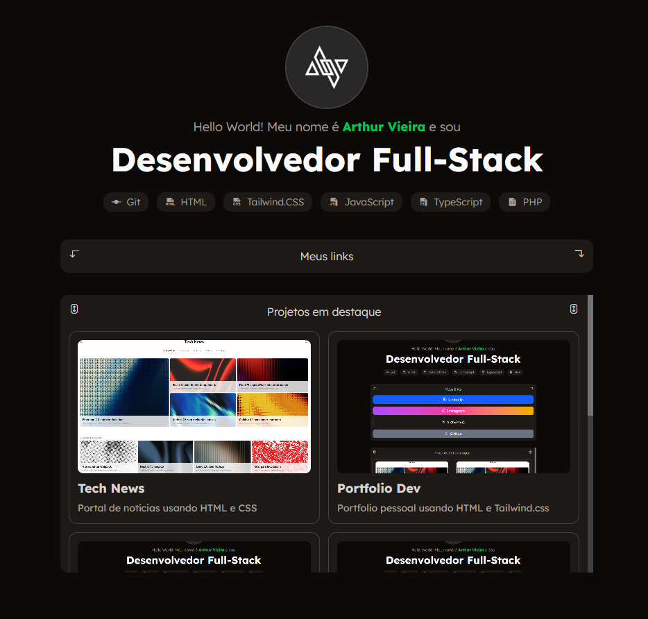

# Portfolio Dev


<br>



## Sobre o projeto

**Portfolio Pessoal Dev** é uma landing page para desenvolvedor full-stack, apresentando logo, bio, skills e links para redes sociais. O design dark mode é totalmente responsivo com Tailwind CSS, seções interativas como detalhes expandíveis e grid de projetos em destaque.

## Tecnologias utilizadas

- HTML5 semântico com meta tags Open Graph  
- Tailwind CSS via CDN  
- Phosphor Icons via CDN
- Google Fonts (Lexend Deca)  

## Funcionalidades

- Hero section com logo arredondado, bio e badges de skills
- Seção de links expandível (details/summary) com ícones e gradientes  
- Grid responsivo de projetos (1 col mobile, 2 col desktop) com imagens e hover effects  
- Scrollbar customizada na seção de projetos  
- Footer com link para GitHub  

## Como executar o projeto

1. Clone o repositório no seu computador
```bash
git clone https://github.com/developerarthurvieira/portfolio-dev
```

2. Clique duas vezes no arquivo index.html
